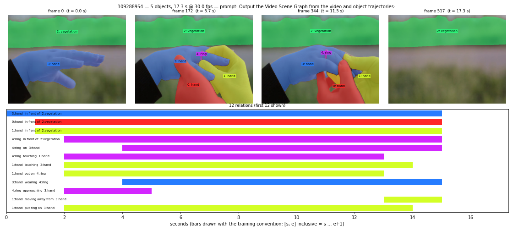

# Sample 109288954

- video: 17.3 s, 518 frames @ 29.97 fps; mask frames: 518
- prompt: `Output the Video Scene Graph from the video and object trajectories:`

## Objects

| id | label | attributes |
|---|---|---|
| 0 | hand | smooth, curved, rounded, skin-toned, soft, fingers bent |
| 1 | hand | warm skin tone, smooth, slightly glossy, delicate fingertips, fingers gracefully curved, fingers slightly bent, thumb positioned close to index finger |
| 2 | vegetation | verdant, dense, lush, leafy, continuous, unbroken, uniform, extensive, undulating, organic |
| 3 | hand | smooth, tanned, creed?, extended, curved, adorned |
| 4 | ring | slender, metallic, smooth, polished, lustrous, shiny, reflective, embellished, stone-studded, elegant, decorative |

## Relations

| subject | predicate | object | spans (s) |
|---|---|---|---|
| 3: hand | in front of | 2: vegetation | [[0, 14]] |
| 0: hand | in front of | 2: vegetation | [[1, 14]] |
| 1: hand | in front of | 2: vegetation | [[1, 14]] |
| 4: ring | in front of | 2: vegetation | [[2, 14]] |
| 4: ring | on | 3: hand | [[4, 14]] |
| 4: ring | touching | 1: hand | [[2, 12]] |
| 1: hand | touching | 3: hand | [[2, 12], [2, 13]] |
| 1: hand | put on | 4: ring | [[2, 12]] |
| 3: hand | wearing | 4: ring | [[4, 14]] |
| 4: ring | approaching | 3: hand | [[2, 4]] |
| 1: hand | moving away from | 3: hand | [[13, 14]] |
| 1: hand | put ring on | 3: hand | [[2, 13]] |
