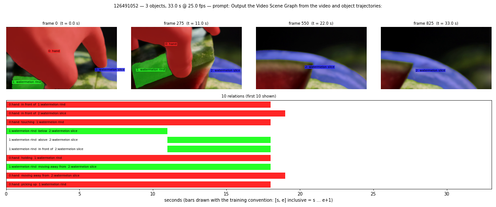

# Sample 126491052

- video: 33.0 s, 826 frames @ 25.00 fps; mask frames: 826
- prompt: `Output the Video Scene Graph from the video and object trajectories:`

## Objects

| id | label | attributes |
|---|---|---|
| 0 | hand | skin-toned, smooth, curved, textured, bent-fingers, extended-thumb |
| 1 | watermelon rind | dark-green, mottled, light-green, smooth, glossy, curved, organic |
| 2 | watermelon slice | dark green rind, lighter, almost white stripes along length, translucent stripes, smooth, glossy surface, curved arc shape, elongated wedge form, vibrant color contrast between rind and stripes |

## Relations

| subject | predicate | object | spans (s) |
|---|---|---|---|
| 0: hand | in front of | 1: watermelon rind | [[0, 17]] |
| 0: hand | in front of | 2: watermelon slice | [[0, 18]] |
| 0: hand | touching | 1: watermelon rind | [[0, 17]] |
| 1: watermelon rind | below | 2: watermelon slice | [[0, 10]] |
| 1: watermelon rind | above | 2: watermelon slice | [[11, 17]] |
| 1: watermelon rind | in front of | 2: watermelon slice | [[11, 17]] |
| 0: hand | holding | 1: watermelon rind | [[0, 17]] |
| 1: watermelon rind | moving away from | 2: watermelon slice | [[0, 17]] |
| 0: hand | moving away from | 2: watermelon slice | [[0, 18]] |
| 0: hand | picking up | 1: watermelon rind | [[0, 17]] |
