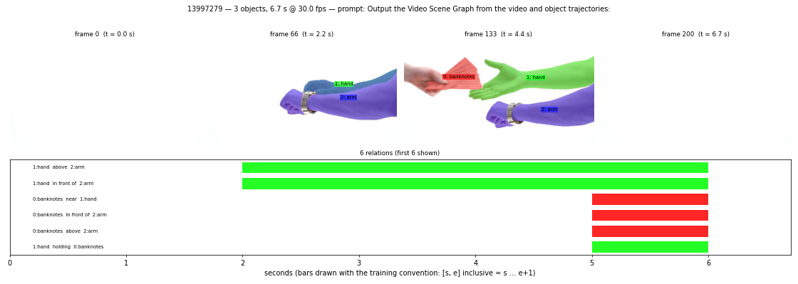

# Sample 13997279

- video: 6.7 s, 201 frames @ 29.97 fps; mask frames: 201
- prompt: `Output the Video Scene Graph from the video and object trajectories:`

## Objects

| id | label | attributes |
|---|---|---|
| 0 | banknotes | rectangular, standard-sized, papery, slightly-curled, slightly-tilted, neatly-aligned, intricately-patterned, text-bearing, denomination-visible, glossy |
| 1 | hand | tan, smooth, soft, creased, curled, inward, arched, well-defined |
| 2 | arm | smooth, faint musculature, unadorned, natural |

## Relations

| subject | predicate | object | spans (s) |
|---|---|---|---|
| 1: hand | above | 2: arm | [[2, 5]] |
| 1: hand | in front of | 2: arm | [[2, 5]] |
| 0: banknotes | near | 1: hand | [[5, 5]] |
| 0: banknotes | in front of | 2: arm | [[5, 5]] |
| 0: banknotes | above | 2: arm | [[5, 5]] |
| 1: hand | holding | 0: banknotes | [[5, 5]] |
