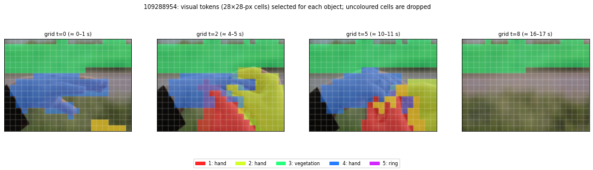

# Phase 3 trace: training sample `109288954`

Every number below comes from the official code path of one training step (data loader → collator → `compute_loss` steps 1–4 → model forward), without the backward pass.

## 3.1 Frame sampling and preprocessing

- video: 17.3 s, 518 frames at 29.97 fps
- sampled 17 frames (`round(duration)`, clamped to 4–128), effective fps **0.984**; frame indices: [0, 32, 64, 96, 129, 161, 193, 226] …
- resized frame: 448 × 616 px → grid (T, H, W) = (9, 32, 44) patches of 14 px
- one visual token = 2 frames × 28×28 px → 9 temporal grids × 16×22 = **3168 visual tokens** (352 per grid)

## 3.2 Prompt and labels (data loader + collator)

- sequence length 3666; `<|video_pad|>` placeholders: 3168; supervised (label ≠ -100) tokens: **464** = the JSON answer + `<|im_end|>\n`
- objects after dropping ones with no mask on any sampled frame: 5 (annotation had 5)

Prompt as the model sees it:

```
<|im_start|>system
You are a helpful assistant.<|im_end|>
<|im_start|>user
Output the Video Scene Graph from the video and object trajectories:
<|vision_start|>[3168 × <|video_pad|>]<|vision_end|>
<|im_end|>
<|im_start|>assistant
{"
```

The answer it is trained to write (decoded labels, first 600 characters):

```
{"objects": [{"object 1": "hand", "attributes": ["smooth", "curved", "rounded", "skin-toned", "soft", "fingers bent"]}, {"object 2": "hand", "attributes": ["warm skin tone", "smooth", "slightly glossy", "delicate fingertips", "fingers gracefully curved", "fingers slightly bent", "thumb positioned close to index finger"]}, {"object 3": "vegetation", "attributes": ["verdant", "dense", "lush", "leafy", "continuous", "unbroken", "uniform", "extensive", "undulating", "organic"]}, {"object 4": "hand", "attributes": ["smooth", "tanned", "creed?", "extended", "curved", "adorned"]}, {"object 5": "ring"
```

## 3.3 Mask → visual-token selection (Eq. 1–2, `select_tokens`)

Coverage of a token = fraction of its 28×28-px square covered by the mask, max over its 2 frames; selected if ≥ 0.5.

| object | label | tokens selected | temporal grids present (of 9) | best coverage | fallback used? |
|---|---|---|---|---|---|
| 1 | hand | 315 | 7 | 1.00 | no |
| 2 | hand | 352 | 7 | 1.00 | no |
| 3 | vegetation | 965 | 9 | 1.00 | no |
| 4 | hand | 519 | 7 | 1.00 | no |
| 5 | ring | 1 | 1 | 0.58 | no |

- tokens selected by ≥1 object: 2039 of 3168; **dropped (belong to no object): 35.6%**
- tokens claimed by more than one object: 113



## 3.4 Trajectory-aligned arrangement (`rearrange_token`)

- sequence: 3666 tokens before → **1419 after** (3168 video placeholders replaced by 5 object blocks)
- length check: prefix+suffix 496 + predicted object blocks 923 = 1419 ✓ matches
- position ids: the 3 M-RoPE rows identical? **True**; equal to 0…L-1? **True** → plain 1D positions, no (time, row, column) for visual tokens (P9)
- supervised tokens before 464 → after 464 (arrangement must not touch the answer)
- window labels: ['<0 - 4 sec>', '<4 - 8 sec>', '<8 - 12 sec>', '<12 - 16 sec>', '<16 - 20 sec>']

The object blocks as the LLM reads them:

```
<obj_traj_start>Object 1: <|vision_start|>[32 × resampled vector]<0 - 4 sec>[32 × resampled vector]<4 - 8 sec>[32 × resampled vector]<8 - 12 sec>[32 × resampled vector]<12 - 16 sec>[32 × resampled vector]<|vision_end|><obj_traj_end>
<obj_traj_start>Object 2: <|vision_start|>[32 × resampled vector]<0 - 4 sec>[32 × resampled vector]<4 - 8 sec>[32 × resampled vector]<8 - 12 sec>[32 × resampled vector]<12 - 16 sec>[32 × resampled vector]<|vision_end|><obj_traj_end>
<obj_traj_start>Object 3: <|vision_start|>[32 × resampled vector]<0 - 4 sec>[32 × resampled vector]<4 - 8 sec>[32 × resampled vector]<8 - 12 sec>[32 × resampled vector]<12 - 16 sec>[32 × resampled vector]<16 - 20 sec>[32 × resampled vector]<|vision_end|><obj_traj_end>
<obj_traj_start>Object 4: <|vision_start|>[32 × resampled vector]<0 - 4 sec>[32 × resampled vector]<4 - 8 sec>[32 × resampled vector]<8 - 12 sec>[32 × resampled vector]<12 - 16 sec>[32 × resampled vector]<|vision_end|><obj_traj_end>
<obj_traj_start>Object 5: <|vision_start|>[32 × resampled vector]<12 - 16 sec>[32 × resampled vector]<|vision_end|><obj_traj_end>
```

## 3.5 The two resamplers

- parameters: OTR (`second_perceiver_resampler`) 174.7 M, TWR (`perceiver_resampler`) 174.7 M, together 349 M on top of 3.75 B
- latents: 32 (OTR) and 32 (TWR) vectors of size 2048
- **permutation test** on object 3 (965 tokens → 32×2048): shuffling its tokens changes the OTR output by 4.99e-03 (relative max abs diff); reversing their time order: 7.48e-03. ≈ 0 (fp16 rounding) means the resampler cannot see token order (P8).
- learned latents, mean / min pairwise cosine similarity: OTR 0.999 / 0.995, TWR 1.000 / 1.000 (at initialisation all are 1.0: every latent = all ones; P21)

## 3.6 Forward pass and loss

- loss on the true answer: **0.515** (mean cross-entropy over 464 answer tokens; perplexity 1.67)

Corrupted answers (same video, same masks). A higher loss means the model *uses* that information:

| answer | loss | Δ vs true |
|---|---|---|
| true | 0.515 | – |
| names_rotated | 0.873 | +0.358 |
| spans_shifted_+4s | 0.584 | +0.069 |
| subject_object_swapped | 0.585 | +0.071 |

Peak GPU memory: 9.8 GB

