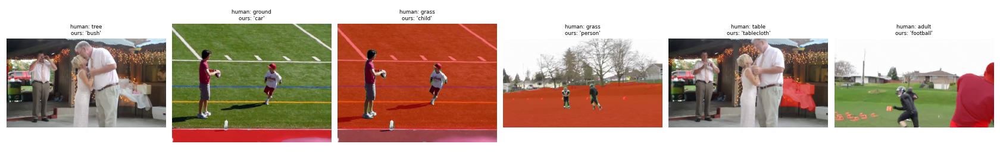

# PVSG, Option A: pipeline vs human labels

Videos: 0027_4571353789, 0028_4021064662, 0039_6951351121, 1122_3393449055

## Objects

| video | human things | things found | human stuff | stuff found | our tracks | extra tracks | named right | matched & described |
|---|---|---|---|---|---|---|---|---|
| 0027_4571353789 | 12 | 9 | 4 | 1 | 57 | 47 | 8 | 10 |
| 0028_4021064662 | 8 | 4 | 2 | 2 | 8 | 2 | 4 | 6 |
| 0039_6951351121 | 14 | 2 | 3 | 2 | 36 | 32 | 2 | 4 |
| 1122_3393449055 | 8 | 8 | 1 | 0 | 47 | 39 | 6 | 8 |

Human stuff (floor, ground, grass, …) named as an object: 4 of 5 found (as a person: 2)

- 0027_4571353789: human `tree` → ours `bush` (`plant`)
- 0028_4021064662: human `ground` → ours `car` (`car`)
- 0028_4021064662: human `grass` → ours `child` (`child`)
- 0039_6951351121: human `grass` → ours `person` (`adult`)

## Final scores (per human label; missed objects count as failures)

| | object accuracy | relation recall | relation recall, ignoring time | triplet recall | triplet recall, ignoring time |
|---|---|---|---|---|---|
| strict | 38.5% | 5.1% | 8.5% | 3.4% | 5.1% |
| close | 40.4% | 5.1% | 8.5% | 5.1% | 8.5% |
| lenient | 46.2% | 8.5% | 15.3% | 8.5% | 15.3% |

52 human objects, 59 human relations. SVG2 paper, PVSG, lenient, tIoU 0.5 (a model given trajectories, not the pipeline): GPT-5 object 54.2 / relation 18.3 / triplet 16.6 (Table 2); TraSeR with pipeline masks 63.4 / 13.4 / 10.0 (Table 12).

## Names: strict vs lenient

| | right | of |
|---|---|---|
| strict | 20 | 28 |
| close | 21 | 28 |
| lenient | 24 | 28 |

Mapping with bare names: 19/28 right; with descriptions: 20/28.

## Naming errors (human → our word (mapped class): judge)

- 0027_4571353789: human `tree` → ours `bush` (`plant`): related
- 0027_4571353789: human `table` → ours `tablecloth` (`cloth`): related
- 0028_4021064662: human `ground` → ours `car` (`car`): mismatch
- 0028_4021064662: human `grass` → ours `child` (`child`): mismatch
- 0039_6951351121: human `grass` → ours `person` (`adult`): mismatch
- 0039_6951351121: human `adult` → ours `football` (`ball`): mismatch
- 1122_3393449055: human `child` → ours `baby` (`baby`): narrower
- 1122_3393449055: human `table` → ours `countertop` (`countertop`): related

## Relations: strict vs lenient

| | with time (tIoU ≥ 0.5) | ignoring time | of |
|---|---|---|---|
| strict | 3 | 5 | 59 |
| close | 3 | 5 | 59 |
| lenient | 5 | 9 | 59 |

## Naming errors (strict)

- 0027_4571353789: human `tree` → ours `bush` (`plant`)
- 0027_4571353789: human `table` → ours `tablecloth` (`cloth`)
- 0028_4021064662: human `ground` → ours `car` (`car`)
- 0028_4021064662: human `grass` → ours `child` (`child`)
- 0039_6951351121: human `grass` → ours `person` (`adult`)
- 0039_6951351121: human `adult` → ours `football` (`ball`)
- 1122_3393449055: human `child` → ours `baby` (`baby`)
- 1122_3393449055: human `table` → ours `countertop` (`countertop`)

## Relations

| video | human relations | correct | wrong time | wrong predicate | reversed | pair not related | object missed | our relations | ours between found objects | of those also in PVSG (any time) | our predicates with no PVSG match |
|---|---|---|---|---|---|---|---|---|---|---|---|
| 0027_4571353789 | 17 | 1 | 1 | 1 | 0 | 4 | 10 | 9 | 6 | 2 | 7 |
| 0028_4021064662 | 18 | 0 | 0 | 4 | 0 | 8 | 6 | 9 | 7 | 0 | 3 |
| 0039_6951351121 | 13 | 0 | 0 | 0 | 0 | 1 | 12 | 10 | 0 | 0 | 5 |
| 1122_3393449055 | 11 | 2 | 1 | 6 | 0 | 2 | 0 | 13 | 10 | 3 | 4 |

