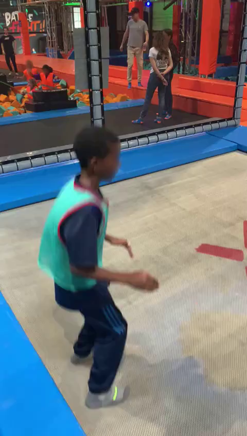
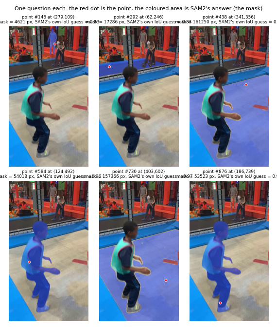
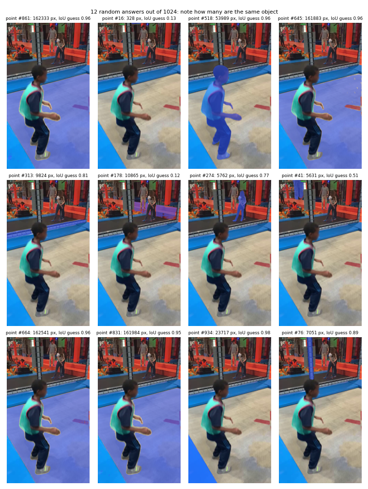
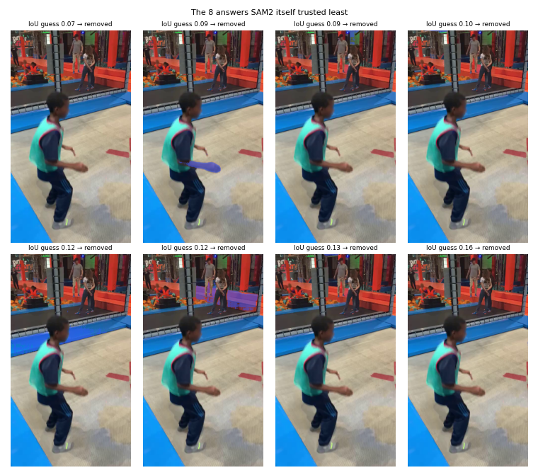
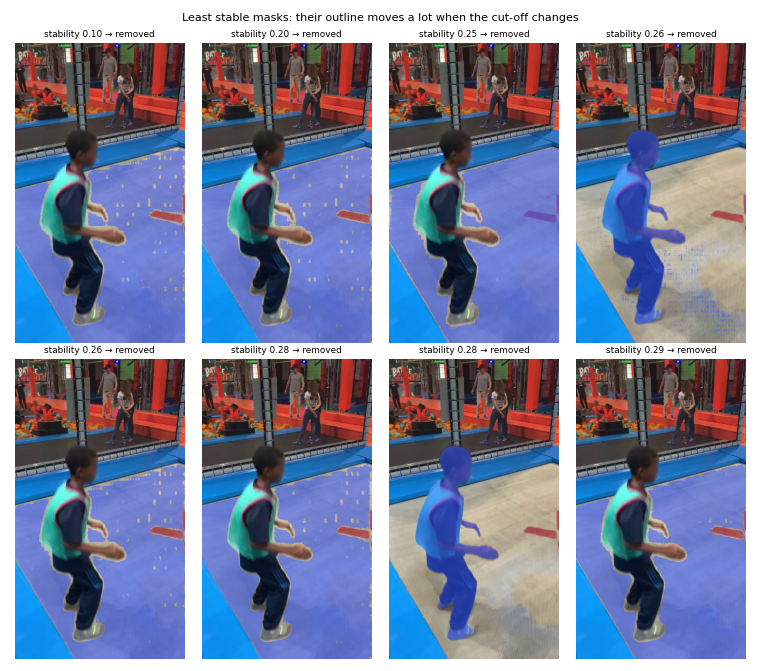
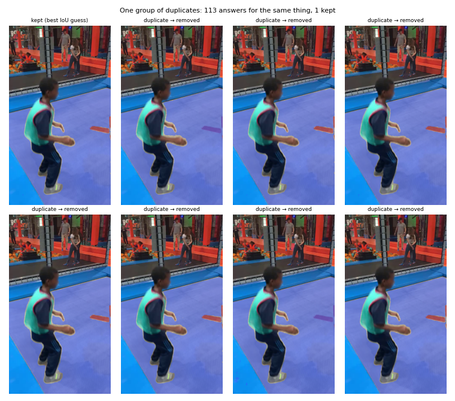
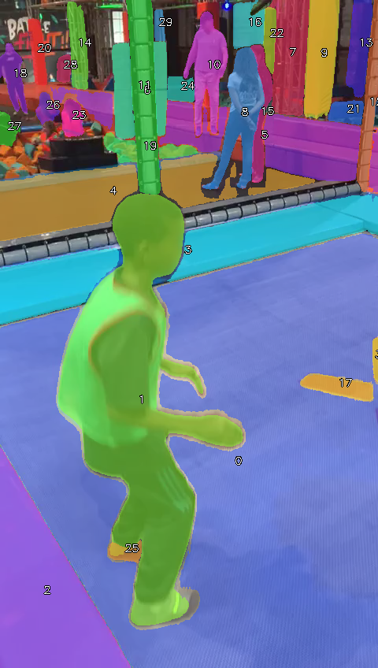
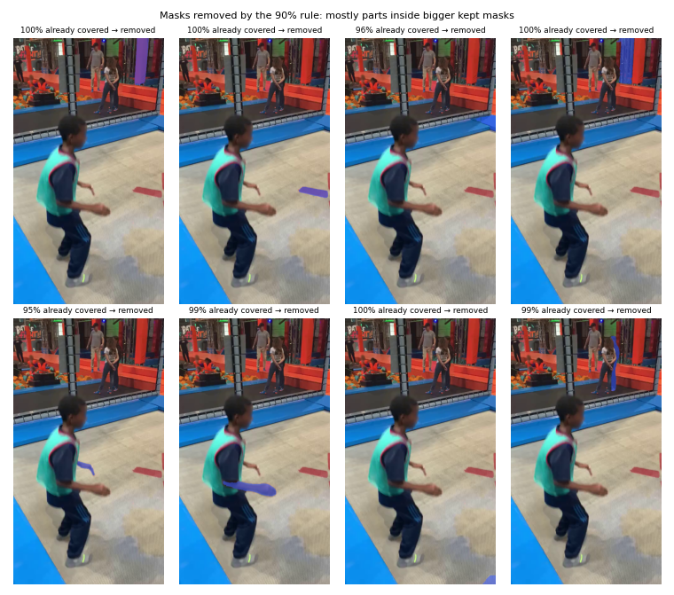
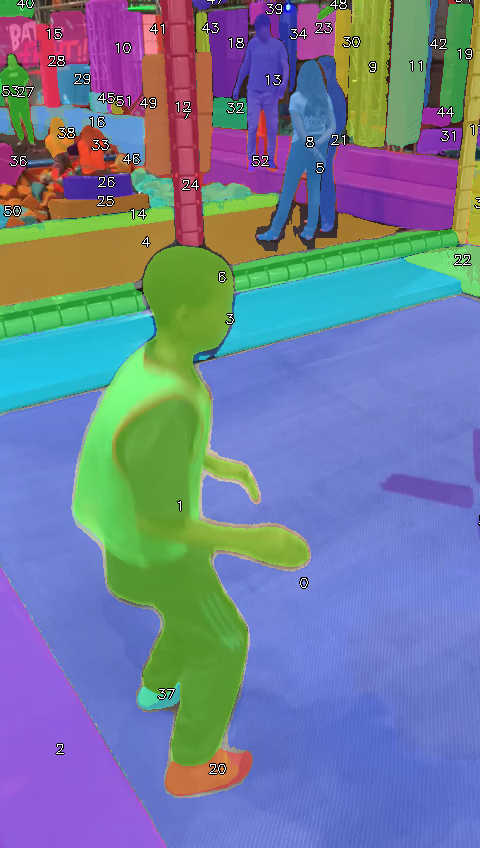
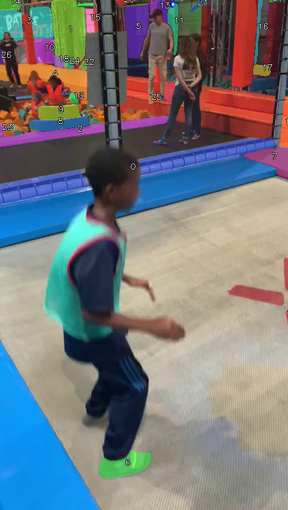

# Stage 1 by hand: `sav_000001.mp4`, frame 0

## Step 0: the input

The video has 483 frames at 24 fps (20.1 s). The real pipeline runs stage 1 on every 20th frame (25 frames); here we do one of them. The frame is a 480×848 RGB image: that is all SAM2 gets, no labels, no boxes.

## Step 1: put a grid of points on the frame

32×32 = **1024 points**, one every 15 px across and 27 px down. Each red dot is one *point* = one pixel where we will ask SAM2 "what is here?". (Their `make_point_grid` uses `linspace(0, 1)`, so the outer points sit exactly on the image border; SAM2's own default grid starts half a step inside.)

SAM2 (`facebook/sam2.1-hiera-large`) loaded; the image encoder ran once on the frame (14.0 s). Every question below reuses that encoding: asking about a point is cheap.

## Step 2: one point in → one mask out

Six of the grid points, asked one at a time. A single pixel (red dot) returns the *whole* object under it. The number in each title is SAM2's guess of how good its own mask is ("predicted IoU").

## Step 3: ask about every point

All 1024 points, in batches of 64: **1024 masks** in 5.3 s. Most are repeats: big regions get hit by dozens of points. Mask sizes: median 23702 px, smallest 14 px, largest 181718 px (frame = 407040 px).

## Step 4: drop answers SAM2 itself doubts (`pred_iou_thresh = 0.75`)

1024 → **822** masks (202 removed with predicted IoU ≤ 0.75). These are typically points on edges, shadows or textures where "the object here" is ambiguous.

## Step 5: drop unstable masks (`stability_score_thresh = 0.85`)

SAM2 outputs a score per pixel; the mask is "score > 0". Cut it once strictly (> +1) and once loosely (> −1): a clean object gives almost the same shape both times (IoU near 1), a vague blob does not.

822 → **417** masks (405 unstable removed).

## Step 6: remove duplicates (NMS, `box_nms_thresh = 0.7`)

Sort by SAM2's confidence; walk down the list; delete a mask if its bounding box overlaps an already kept box with IoU > 0.7.

417 → **43** masks. The biggest duplicate group had 113 copies of one object.

## Step 7: tidy each mask (`min_mask_region_area = 200`)

Fill holes and delete stray specks smaller than 200 px inside each mask: 17 of 43 masks were touched, 40 remain. (SAM2 then re-runs duplicate removal; skipped here.)

## Step 8: the 90% filter (paper p.20)

Biggest first; keep a mask only if less than 90% of it is already covered by the masks kept before it.

40 → **31 masks** = our stage-1 result for this frame (their `select_max_non_overlapping` gives 31: ✓ same). Together they cover 86% of the frame.

Summary of the funnel:

| step | masks |
|---|---|
| 3. one answer per point | 1024 |
| 4. confident (pred IoU > 0.75) | 822 |
| 5. stable (≥ 0.85) | 417 |
| 6. after duplicate removal | 43 |
| 7. after tidying | 40 |
| 8. after the 90% filter | **31** |

## Step 9: the official stage 1 (with zoomed crops) on the same frame

`svg2_pipeline.AutomaticMaskGenerator` with Table 7 settings (32×32 grid on the frame + 16×16 on 4 crops + 4×4 on 16 crops, plus one mask-refinement step `use_m2m`), then the 90% filter: 91 → **56 masks** in 40.8 s.

| | ours (full frame only) | official (with crops) |
|---|---|---|
| masks | 31 | 56 |
| smallest mask (px) | 341 | 40 |
| median mask (px) | 2096 | 1442 |

**29 official masks have no match (IoU ≥ 0.5) in ours**: these are what zooming in found.

