# Stages 1–2 by hand: `sav_000001`, first 120 frames

Video `sav_000001.mp4`: 483 frames, 24 fps, 480x848, 20.1 s. We use the first 120 frames (5.0 s).

Stage 1 frames (every 20th): [0, 20, 40, 60, 80, 100]

Re-discovery stride = 20 × (120 // 100 + 1) = 40 frames → checks at [0, 40, 80] (the seed frame 0 itself is skipped)

Stage-1 results stage 2 actually reads: [0, 40, 80]  (3 of 6)

  a 120-frame video: stage 1 on 6 frames, 3 used; a new object can only be added every 40 frames = 1.7 s at 24 fps

  a 483-frame video: stage 1 on 25 frames, 5 used; a new object can only be added every 100 frames = 4.2 s at 24 fps

  a 1000-frame video: stage 1 on 50 frames, 5 used; a new object can only be added every 220 frames = 9.2 s at 24 fps

  a 3000-frame video: stage 1 on 150 frames, 5 used; a new object can only be added every 620 frames = 25.8 s at 24 fps

Stage 1, frame 0: 101 SAM2 masks → 59 after the 90% filter (43 s)

Stage 1, frame 40: 98 SAM2 masks → 52 after the 90% filter (82 s)

Stage 1, frame 80: 98 SAM2 masks → 57 after the 90% filter (123 s)

One object (stage-1 mask #1 of frame 0) tracked through 120 frames in 139 s

Pass 1: seeded 59 objects at frame 0

Pass 1, check at frame 40: untracked 12% of the frame; 52 stage-1 masks → 1 new (code rule). Paper Eq. 11 ratio, all masks together: 0.73

   → registered objects 59…59 at frame 40; propagation restarts at frame 41

Pass 1, check at frame 80: untracked 10% of the frame; 57 stage-1 masks → 3 new (code rule). Paper Eq. 11 ratio, all masks together: 0.80

   → registered objects 60…62 at frame 80; propagation restarts at frame 81

Pass 1 done: 63 objects (1988 s)

Over all checks: 44 unmatched stage-1 masks were ignored for covering < 10% of the untracked area on their own

Pass 2 done (2059 s)

Mean mask coverage: pass 1 only 0.910 → pass 1 + pass 2 0.928  (paper, 100 videos: 0.435 → 0.486)

Object 59: registered at frame 40; pass 2 gives it a mask in 13 of the 40 earlier frames (from frame 27)

Object 60: registered at frame 80; pass 2 gives it a mask in 43 of the 80 earlier frames (from frame 37)

Object 61: registered at frame 80; pass 2 gives it a mask in 55 of the 80 earlier frames (from frame 25)

Object 62: registered at frame 80; pass 2 gives it a mask in 63 of the 80 earlier frames (from frame 17)

Official stage2_track: 63 objects (ours 63); same registration frames: True; mask IoU ours vs theirs: mean 1.0000, min 1.0000 (4056 s)

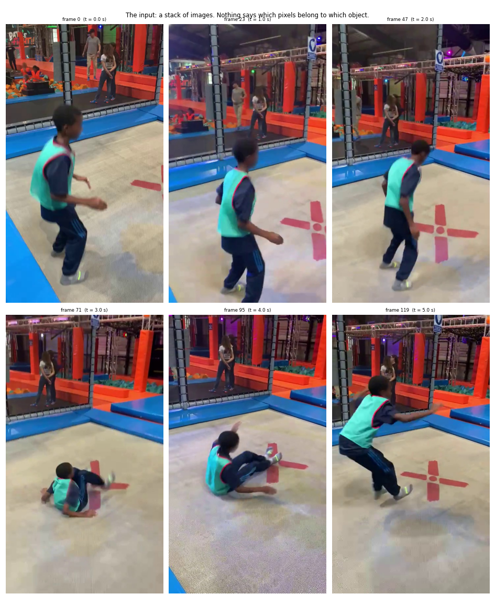
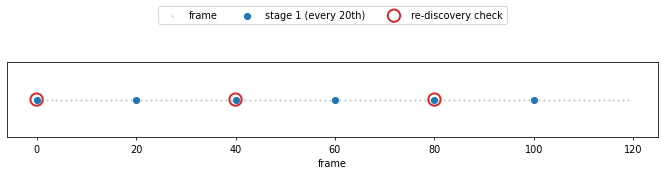
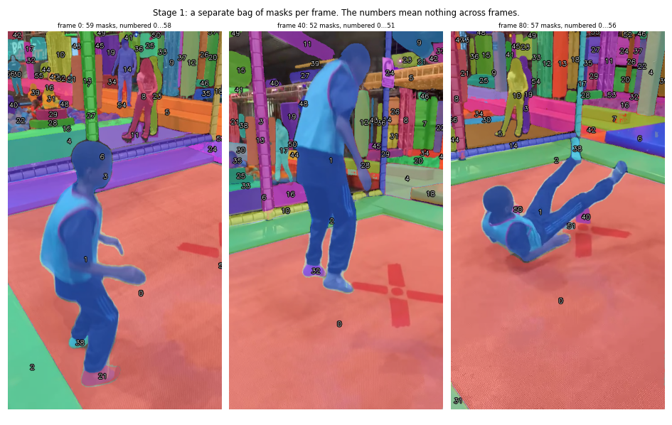
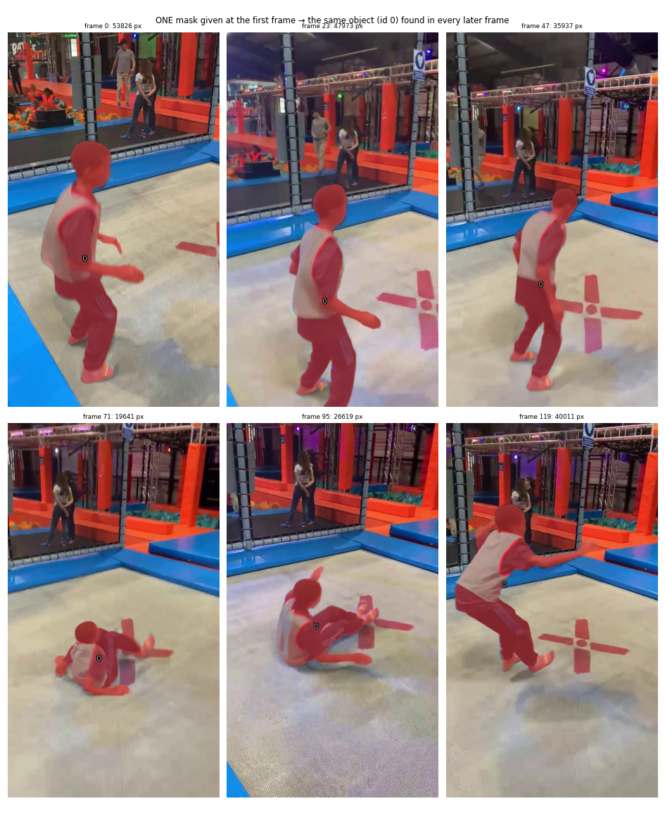
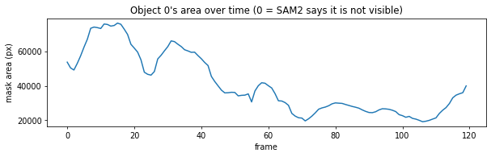
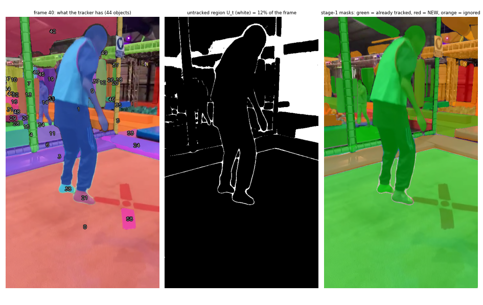
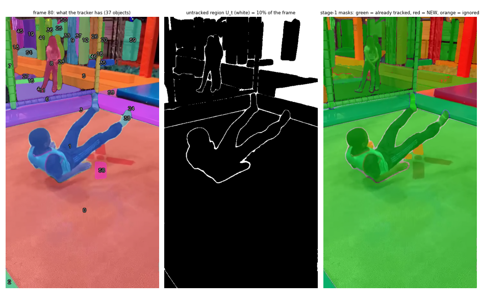
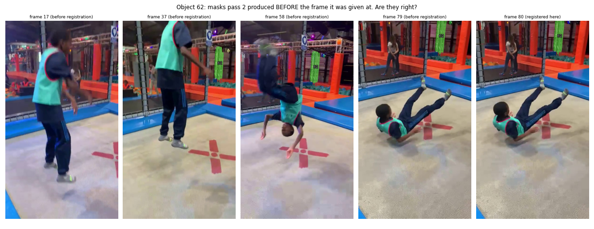
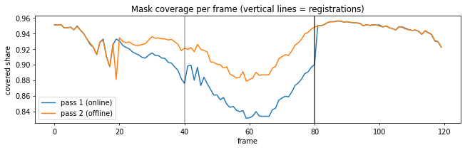
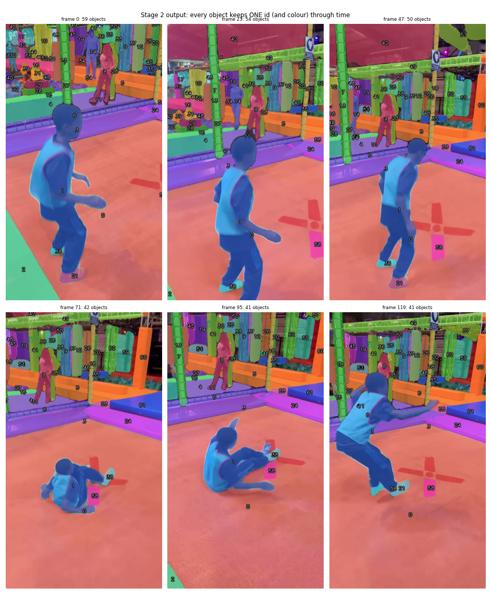
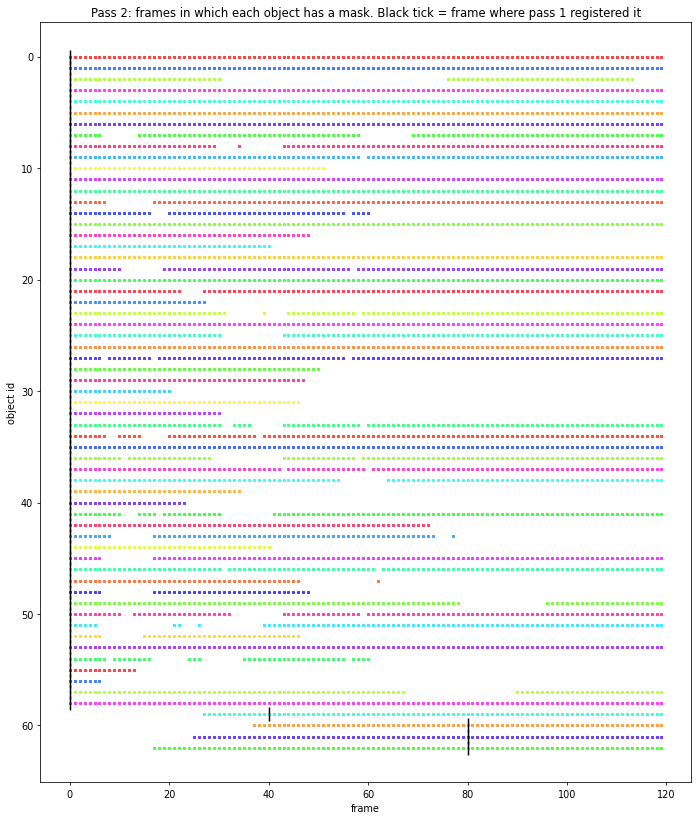
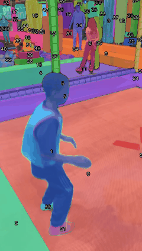
