# Stages 3–4 on `sav_000001` (first 120 frames)

Loaded `data/stage12/sav_000001_first120_tracks.json`: 63 objects × 120 frames (480x848, 24 fps); 5508 non-empty masks. No SAM2 needed.
Stage 3 dedupe: id 58 deleted, kept id 0. Visible together in 120 frames; id 58 was ≥90% inside id 0 in 94% of them (the other way round: 0%); stability scores deleted 325 vs kept 9586
Stage 3 dedupe: id 11 deleted, kept id 4. Visible together in 120 frames; id 11 was ≥90% inside id 4 in 86% of them (the other way round: 3%); stability scores deleted 449 vs kept 609
Stage 3 dedupe: id 53 deleted, kept id 5. Visible together in 120 frames; id 53 was ≥90% inside id 5 in 71% of them (the other way round: 0%); stability scores deleted 233 vs kept 1044
Stage 3 dedupe: id 51 deleted, kept id 34. Visible together in 90 frames; id 51 was ≥90% inside id 34 in 93% of them (the other way round: 79%); stability scores deleted 264 vs kept 276
Stage 3: 63 → 59 objects
Smoothing: share of pixels removed per object (top 5): id 56 22.0% (2 frames emptied), id 55 3.1% (0 frames emptied), id 37 1.8% (0 frames emptied), id 43 1.6% (0 frames emptied), id 57 1.3% (0 frames emptied)
Objects after stage 3: 59; described: 40; dropped (no description → no name): [37, 29, 28, 50, 22, 46, 31, 32, 43, 30, 39, 44, 47, 40, 48, 54, 52, 55, 56]
id 0: visible in 120 frames; code (uniform) → [0, 17, 34, 51, 68, 85, 102, 119]; paper's rule (max area) → [87, 88, 89, 90, 91, 92, 99, 100]
id 1: visible in 120 frames; code (uniform) → [0, 17, 34, 51, 68, 85, 102, 119]; paper's rule (max area) → [8, 9, 11, 12, 13, 14, 15, 16]
id 3: visible in 120 frames; code (uniform) → [0, 17, 34, 51, 68, 85, 102, 119]; paper's rule (max area) → [69, 70, 74, 88, 89, 90, 91, 92]
id 5: visible in 120 frames; code (uniform) → [0, 17, 34, 51, 68, 85, 102, 119]; paper's rule (max area) → [79, 80, 81, 82, 83, 84, 85, 86]
id 42: visible in 73 frames; code (uniform) → [0, 10, 20, 30, 41, 51, 61, 72]; paper's rule (max area) → [20, 21, 22, 23, 24, 42, 44, 45]
DAM loaded (nvidia/DAM-3B-Video, prompt mode full+focal_crop) in 76 s
One frame's tensor: (1, 8, 384, 384) = (1 frame, 4 full-view channels + 4 focal channels, 384, 384)
After SigLIP + cross-attention + projector: (8, 196, 2560) = (8 frames, 196 image tokens each, 2560 numbers per token)
Prompt = 79 text tokens + 8 × 196 image tokens = 1647 positions in the language model
Described 40 objects in 398 s
Reproducibility, object 1: run 2 vs run 1: identical=False, word overlap 59%
Reproducibility, object 1: run 3 vs run 1: identical=False, word overlap 59%

## The prompt (identical for every object)

```
A chat between a curious user and an artificial intelligence assistant. The assistant gives helpful, detailed, and polite answers to the user's questions. USER: Video: <image> <image> <image> <image> <image> <image> <image> <image>
Given the video in the form of a sequence of frames above, describe the object in the masked region in the video in detail. ASSISTANT:
```

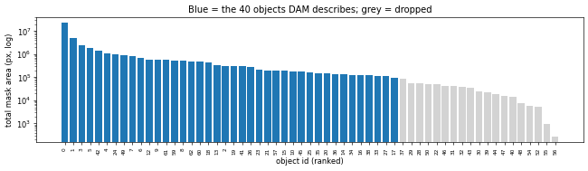

## Descriptions

### object 0 (rank 1, frames [0, 17, 34, 51, 68, 85, 102, 119])

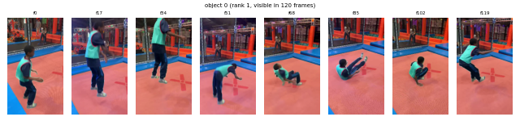

> A young person, dressed in a vibrant green shirt and dark pants, is energetically engaged in a playful activity. They are wearing bright green shoes that stand out against the muted tones of their attire. The individual appears to be in motion, possibly jumping or performing a playful maneuver, as indicated by the dynamic posture and the slight blur of their limbs. Their arms are bent at the elbows, suggesting a sense of balance and coordination. The person's head is slightly tilted, adding to the impression of movement and excitement. Throughout the sequence, the individual maintains a lively and spirited demeanor, embodying the essence of youthful exuberance and playfulness.

### object 1 (rank 2, frames [0, 17, 34, 51, 68, 85, 102, 119])

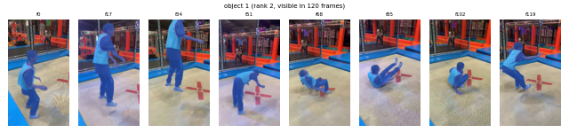

> A young person, wearing a bright green vest with red trim and dark blue pants with light blue stripes, is captured in a dynamic sequence of movement. Initially, they are seen in a side profile, suggesting a moment of balance or preparation. As the sequence progresses, the individual shifts their weight, bending slightly forward, indicating a readiness to engage in an activity. Their arms are extended, possibly reaching out or preparing to interact with something in front of them. The person then transitions into a crouched position, with their legs bent and arms extended, suggesting a playful or athletic maneuver. This is followed by a moment where they are airborne, with their legs bent and arms reaching upwards, as if they are jumping or performing a flip. The sequence concludes with the individual landing back on their feet, maintaining a poised and energetic stance, ready for the next action. Throughout the sequence, the person's movements are fluid and expressive, conveying a sense of youthful exuberance and agility.

### object 3 (rank 3, frames [0, 17, 34, 51, 68, 85, 102, 119])


> A blue mat, likely part of a trampoline or similar gym equipment, is prominently featured. It appears to be a rectangular piece with a smooth, slightly glossy surface, designed to provide cushioning and safety. The mat is positioned horizontally, with its edges aligned parallel to the ground, suggesting it is part of a larger structure. As the sequence progresses, the mat remains stationary, indicating its role as a stable platform. Its vibrant blue color stands out, adding a sense of energy and playfulness to the scene. The mat's consistent appearance throughout the sequence suggests it is a durable and reliable component, designed to withstand frequent use and impact. Its presence implies a setting where physical activity and safety are prioritized.

### object 5 (rank 4, frames [0, 17, 34, 51, 68, 85, 102, 119])

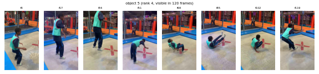

> A vibrant orange bench, characterized by its sturdy, rectangular form and smooth surface, extends horizontally across the sequence. Its bright hue stands out, suggesting a playful and inviting design, likely intended for recreational use. The bench maintains a consistent appearance throughout, with its flat top and slightly angled sides providing a comfortable seating area. As the sequence progresses, the bench remains stationary, emphasizing its role as a stable and reliable fixture. Its presence suggests a space designed for leisure and interaction, inviting passersby to pause and rest. The bench's design is both functional and aesthetically pleasing, contributing to the overall lively atmosphere of the environment.

### object 42 (rank 5, frames [0, 10, 20, 30, 41, 51, 61, 72])

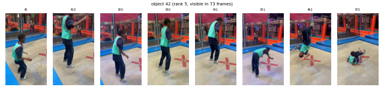

> A rectangular signboard with a dark background and bold, white lettering is prominently displayed. The letters are evenly spaced and appear to be part of a larger word or phrase. As the sequence progresses, the signboard remains stationary, maintaining its upright position. The letters are clear and legible, suggesting a message or advertisement. The signboard's surface is smooth, and the lighting highlights the contrast between the white text and the dark background, ensuring the message is easily readable. The signboard's presence is consistent throughout the sequence, indicating its role as a fixed point of information or decoration in the environment.

### object 4 (rank 6, frames [0, 17, 34, 51, 68, 85, 102, 119])

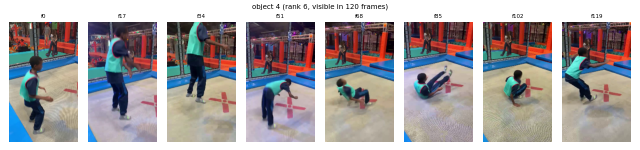

> A rectangular mat, likely used for gym activities, is prominently featured, characterized by its smooth, dark surface and vibrant blue border. The mat appears to be part of a larger setup, possibly for trampoline or gymnastics activities, as suggested by its sturdy construction and the context of the surrounding environment. Throughout the sequence, the mat remains stationary, maintaining its position and form, suggesting its role as a stable foundation for physical activities. The blue border adds a touch of color, contrasting with the darker central area, and highlights its boundary. The mat's consistent appearance and lack of movement imply its function as a supportive surface, designed to absorb impact and provide a safe area for movement. Its presence is integral to the dynamic environment, offering a reliable platform for various physical activities.

### object 24 (rank 7, frames [0, 17, 34, 51, 68, 85, 102, 119])

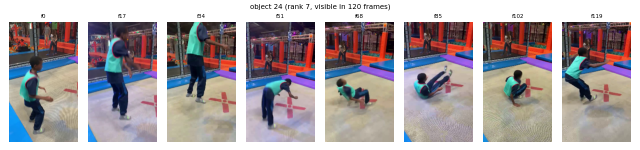

> A blue mat, likely used for gym activities, is prominently featured, showcasing its smooth, slightly glossy surface. Initially, it appears to be positioned horizontally, with its edges neatly aligned, suggesting a well-maintained and sturdy structure. As the sequence progresses, the mat maintains its form, with subtle shifts in perspective indicating a gentle movement or adjustment. The mat's surface reflects light, highlighting its clean and polished texture. Throughout the sequence, the mat remains the central focus, its vibrant blue color standing out distinctly. The consistent appearance of the mat suggests it is designed for durability and comfort, suitable for various physical activities. Its presence is both functional and visually striking, contributing to the dynamic environment it inhabits.

### object 49 (rank 8, frames [0, 14, 29, 43, 58, 72, 104, 119])

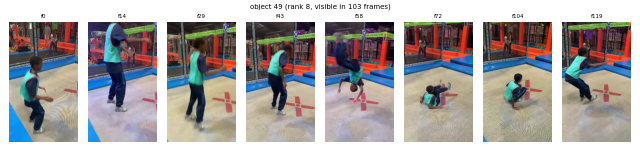

> A metallic structure, likely a truss, extends horizontally with a series of interconnected beams forming a lattice pattern. The surface of the truss is smooth and reflective, catching the ambient light and displaying a spectrum of colors from the surrounding environment. As the sequence progresses, the truss maintains a consistent horizontal alignment, suggesting stability and rigidity. The beams are evenly spaced, creating a repetitive geometric pattern that adds to its structural integrity. The truss appears to be part of a larger framework, possibly used for support or as a stage component. Its presence is steady and unchanging, indicating its role as a stable and integral part of the environment.

### object 7 (rank 9, frames [0, 21, 36, 50, 75, 89, 104, 119])

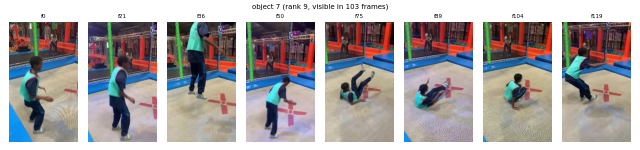

> A tall, slender pole stands vertically, characterized by a series of evenly spaced, rectangular segments that create a rhythmic pattern along its length. The pole's surface is smooth and metallic, reflecting light subtly as it maintains a consistent upright position. Its structure is robust, suggesting durability and strength, typical of a supportive column. Throughout the sequence, the pole remains stationary, exuding a sense of stability and permanence. Its presence is unwavering, serving as a silent sentinel within the environment, likely providing structural support or serving as a visual anchor. The pole's design is both functional and aesthetically pleasing, with its segmented form adding a touch of modernity to its otherwise utilitarian appearance.

### object 6 (rank 10, frames [0, 17, 34, 51, 68, 85, 102, 119])


> A cylindrical object, resembling a trampoline spring, is prominently featured, characterized by its segmented, ribbed design. The object appears to be made of a durable material, likely metal or a similar composite, with a series of evenly spaced, rounded segments that create a rhythmic pattern along its length. As the sequence progresses, the object maintains a consistent horizontal orientation, suggesting it is part of a larger structure, possibly a trampoline. The segments are uniformly aligned, indicating a well-constructed design meant to provide stability and support. Throughout the sequence, the object remains static, emphasizing its role as a supportive component in a dynamic environment. Its presence suggests a connection to the surrounding activity, likely providing the necessary tension and support for the trampoline's function.

### object 12 (rank 11, frames [0, 17, 34, 51, 68, 85, 102, 119])

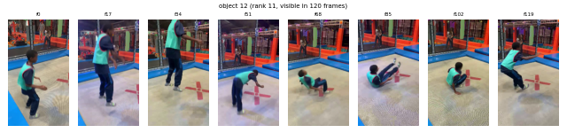

> A tall, rectangular object with a vibrant red hue stands prominently, its surface smooth and slightly reflective, suggesting a material that is both sturdy and flexible. The object maintains a consistent vertical orientation throughout the sequence, indicating stability and a fixed position. Its edges are sharply defined, contributing to a sense of solidity and purpose. As the sequence progresses, the object remains largely unchanged in appearance, with subtle variations in lighting that highlight its texture and color. The object appears to be part of a larger structure, possibly serving as a support or barrier, given its height and the context of its surroundings. Its presence is commanding, drawing attention with its bold color and imposing stature.

### object 9 (rank 12, frames [0, 16, 33, 50, 68, 85, 102, 119])

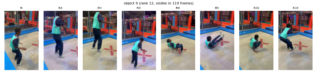

> A tall, slender object, likely a ladder, stands vertically with a series of evenly spaced, parallel rungs running along its length. The object appears to be made of a sturdy material, possibly metal, with a dark, matte finish that suggests durability and strength. As the sequence progresses, the ladder remains stationary, maintaining its upright position. The rungs are uniformly spaced, creating a sense of symmetry and order. The object does not exhibit any movement or interaction with other objects, emphasizing its role as a static structure. Its presence is commanding, drawing attention to its height and the potential for climbing or support. The ladder's design is functional, with a focus on providing stability and accessibility.

### object 61 (rank 13, frames [25, 38, 51, 65, 78, 92, 105, 119])

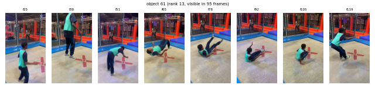

> A large, rectangular blue mat with a smooth, slightly glossy surface is prominently featured. Its edges are well-defined, and the mat appears to be made of a durable material, likely designed for gym or play activities. As the sequence progresses, the mat remains stationary, maintaining its position and shape. The surface reflects light subtly, indicating a clean and well-maintained condition. The mat's vibrant blue color stands out, suggesting it is part of a colorful or themed setup. Throughout the sequence, the mat's presence is consistent, serving as a stable and reliable surface, possibly intended for exercises or play activities.

### object 59 (rank 14, frames [27, 40, 53, 66, 79, 92, 105, 119])

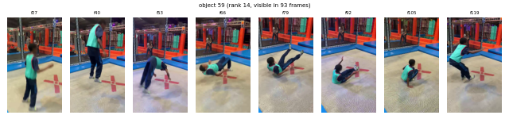

> A tall, rectangular object with a smooth, reflective surface stands prominently, its vertical orientation suggesting a sturdy and solid structure. The object maintains a consistent width throughout its length, with a subtle sheen that catches the light, creating a gentle play of highlights and shadows across its surface. As the sequence progresses, the object remains stationary, exuding a sense of stability and permanence. Its surface appears to be made of a material that reflects its surroundings, giving it a slightly mirrored quality. The object does not interact with other elements, maintaining its solitary presence throughout the sequence. Its uniform appearance and lack of movement suggest it is a fixed installation, possibly serving a functional or decorative purpose within its environment.

### object 8 (rank 15, frames [0, 15, 34, 57, 73, 88, 103, 119])

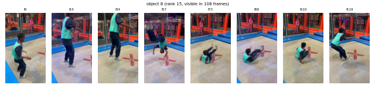

> A person with long, flowing hair is captured in a sequence of movements, wearing a white t-shirt with a graphic design on the front and dark jeans. The individual appears to be engaged in a dynamic activity, possibly involving balance or coordination, as suggested by the initial context. Their posture is slightly bent forward, with arms crossed in front of their body, indicating a focused or concentrated state. As the sequence progresses, the person shifts their weight from one leg to the other, suggesting a rhythmic or repetitive motion. The legs are positioned in a way that implies a sense of agility and control, with one foot slightly lifted, adding to the impression of movement. The overall demeanor is one of engagement and intent, as if the person is participating in a physical challenge or activity that requires both balance and coordination.

### object 62 (rank 16, frames [17, 31, 46, 60, 75, 89, 104, 119])

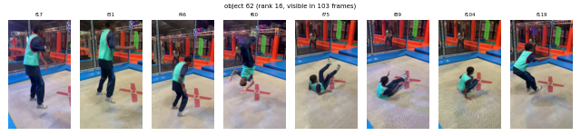

> A tall, slender ladder with a metallic sheen stands prominently, its structure composed of evenly spaced rungs that extend vertically. The ladder's surface reflects a subtle play of light, highlighting its sturdy, industrial design. As the sequence progresses, the ladder remains stationary, its rigid form unwavering. The rungs, evenly spaced, create a rhythmic pattern that suggests stability and strength. The ladder's presence is commanding, yet it maintains a sense of order and precision, indicative of its functional purpose. Throughout the sequence, the ladder's interaction with its surroundings is minimal, emphasizing its role as a static, reliable structure.

### object 60 (rank 17, frames [37, 48, 60, 72, 83, 95, 107, 119])

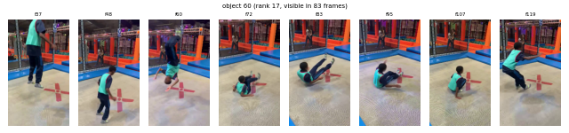

> A tall, rectangular object with a vibrant red hue stands prominently, its surface smooth and slightly reflective, suggesting a material like foam or rubber. The object maintains a consistent vertical orientation throughout the sequence, with its edges sharply defined, giving it a sturdy and solid appearance. As the sequence progresses, the object remains stationary, indicating its role as a stable fixture, possibly part of a larger structure or apparatus. Its bright color and uniform shape suggest it is designed for safety or as a protective barrier, likely intended for impact absorption or as a supportive element in a play or recreational setting. The object’s presence is commanding, drawing attention with its bold color and solid form, while its static nature implies a function of support or protection.

### object 18 (rank 18, frames [0, 17, 34, 51, 68, 85, 102, 119])

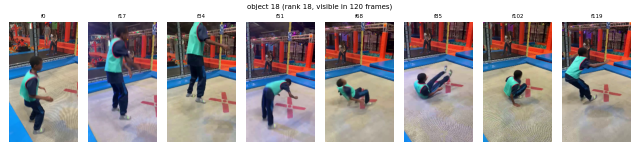

> A tall, slender pole stands vertically, characterized by its segmented, rectangular structure that gives it a ribbed appearance. The pole maintains a consistent, upright posture throughout the sequence, suggesting stability and rigidity. Its surface is smooth, with a uniform gray color that reflects light subtly, enhancing its visibility. The pole's linear form remains unchanged, indicating its role as a fixed, supportive structure. As the sequence progresses, the pole's presence is unwavering, providing a sense of continuity and permanence. Its interaction with the surrounding environment is minimal, emphasizing its function as a static, supportive element within the scene.

### object 13 (rank 19, frames [0, 24, 40, 56, 71, 87, 103, 119])

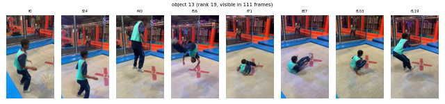

> A tall, rectangular object, likely a padded panel, stands vertically with a smooth, dark surface. Its structure is consistent, maintaining a uniform width and height throughout the sequence. The object appears to be firm and sturdy, suggesting it is designed for impact absorption or support. As the sequence progresses, the object remains stationary, indicating its role as a stable fixture. Its surface is unadorned, emphasizing its functional purpose. The object does not interact with other elements, maintaining its solitary presence in the scene. Its consistent appearance and lack of movement suggest it is a fixed component within its environment, possibly part of a larger structure or apparatus.

### object 2 (rank 20, frames [0, 9, 19, 28, 83, 92, 102, 112])

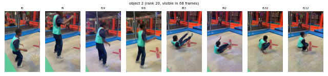

> A vibrant blue mat, likely used for gym activities, stretches across the scene with a smooth, slightly textured surface. Its edges are sharply defined, suggesting a sturdy and durable material. As the sequence progresses, the mat remains stationary, maintaining its position and form. The consistent blue hue of the mat provides a striking contrast against any surrounding elements, emphasizing its presence. The mat's surface appears to be slightly reflective, catching light in a way that highlights its contours and edges. Throughout the sequence, the mat's role as a stable and reliable surface is evident, suggesting its use in providing cushioning or support during physical activities.

### object 19 (rank 21, frames [0, 23, 39, 55, 71, 87, 103, 119])

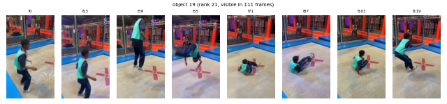

> A tall, rectangular object with a smooth, dark surface stands prominently, its form consistent and unchanging throughout the sequence. The object appears to be a padded panel, likely part of a climbing structure, given its vertical orientation and sturdy appearance. Its surface is uniform, with subtle variations in shading that suggest a soft, cushioned texture. The object remains stationary, maintaining its upright position without any noticeable movement or interaction with other objects. Its presence is commanding, suggesting a role as a support or barrier within the environment, possibly part of a larger climbing apparatus. The consistent lighting highlights its edges, emphasizing its solid and reliable construction.

### object 41 (rank 22, frames [0, 19, 44, 59, 74, 89, 104, 119])

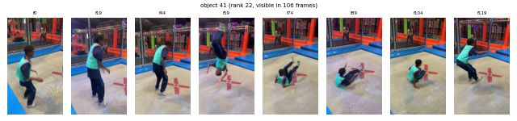

> A tall, rectangular object with a vibrant red hue stands prominently, its surface smooth and uniform. The object appears to be a pillar, characterized by its vertical orientation and consistent color. As the sequence progresses, the pillar maintains its upright position, suggesting stability and sturdiness. Its edges are sharply defined, and the surface reflects light subtly, indicating a polished finish. The pillar's presence is unwavering, suggesting it is a fixed structure, possibly part of a larger framework. Throughout the sequence, the pillar remains a constant, unchanging element, providing a sense of continuity and reliability.

### object 26 (rank 23, frames [0, 17, 34, 51, 68, 85, 102, 119])

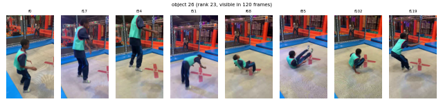

> A tall, slender object, likely a pole, stands vertically with a smooth, dark surface that reflects subtle variations in light, suggesting a metallic or polished finish. Its elongated form remains consistent throughout the sequence, maintaining a straight and unwavering posture. The object appears to be stationary, with no visible movement or interaction with other objects, emphasizing its role as a static element within the scene. Its presence is marked by a consistent width and a slightly reflective quality, which catches glimmers of light as it subtly shifts in perspective. The object’s simplicity and uniformity in appearance contribute to its function as a structural or supportive element, possibly part of a larger framework or barrier.

### object 23 (rank 24, frames [0, 15, 30, 56, 73, 88, 103, 119])

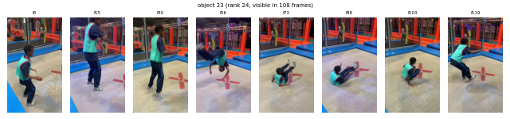

> A person, dressed in dark clothing, is captured in a dynamic sequence of movement. Initially, they appear to be in a crouched position, suggesting a moment of interaction or preparation for an action. As the sequence progresses, the person shifts their weight, indicating a transition from a stationary to a more active stance. Their posture becomes more upright, and their arms are positioned in a way that suggests they are either reaching out or preparing to engage with something or someone nearby. The fluidity of their movements conveys a sense of agility and readiness, as if they are participating in a playful or competitive activity. Throughout the sequence, the person's form remains consistent, with a focus on their upper body and limbs, emphasizing their engagement in the ongoing action.

### object 21 (rank 25, frames [0, 16, 36, 53, 69, 86, 102, 119])

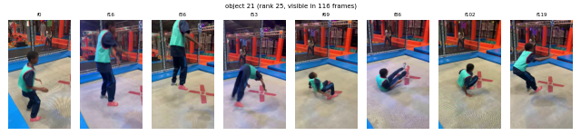

> A shoe, characterized by its smooth, rounded contours and a distinct neon green stripe running along its side, moves dynamically through the sequence. Initially, the shoe appears to be in a stationary position, suggesting a moment of pause or preparation. As the sequence progresses, the shoe begins to pivot, revealing its sleek design and the subtle texture of its material. The neon green stripe becomes more prominent, adding a vibrant contrast to the otherwise muted tones of the shoe. The shoe's motion is fluid, suggesting a gentle shift in direction, possibly indicating a step or a slight turn. Throughout the sequence, the shoe maintains a consistent form, with its contours and the neon stripe remaining a focal point, emphasizing its modern and sporty aesthetic.

### object 57 (rank 26, frames [0, 13, 27, 41, 55, 91, 105, 119])

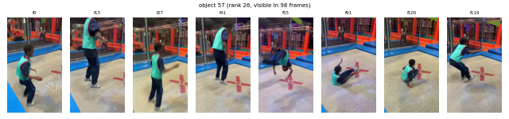

> A dark, elongated object, resembling a pipe, extends horizontally across the sequence. Its surface appears smooth and slightly reflective, catching subtle variations in light as it moves. The object maintains a consistent, linear form, suggesting a rigid structure. Throughout the sequence, it exhibits a gentle, undulating motion, as if swaying slightly in response to an unseen force. This movement is fluid and continuous, giving the impression of a flexible yet sturdy material. The object's orientation shifts subtly, indicating a dynamic interaction with its environment, possibly influenced by external forces or vibrations. Its presence is solitary, with no direct interaction with other objects, emphasizing its distinct and singular motion.

### object 15 (rank 27, frames [0, 17, 34, 51, 68, 85, 102, 119])

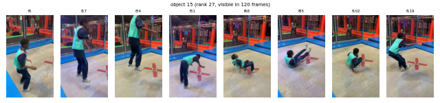

> A long, rectangular blue mat stretches horizontally across the scene, its surface smooth and slightly reflective, suggesting a durable material designed for gym or play activities. The mat maintains a consistent width and appears to be slightly elevated at one end, possibly indicating a raised platform or edge. As the sequence progresses, the mat remains stationary, suggesting its role as a stable base or support structure. Its vibrant blue color stands out, providing a clear visual anchor within the environment. The mat's presence implies functionality, likely serving as a cushioned surface for activities such as gymnastics or exercise, offering both safety and comfort. Throughout the sequence, the mat's form and position remain unchanged, emphasizing its role as a reliable and essential component of the setting.

### object 10 (rank 28, frames [0, 7, 14, 21, 29, 36, 43, 51])

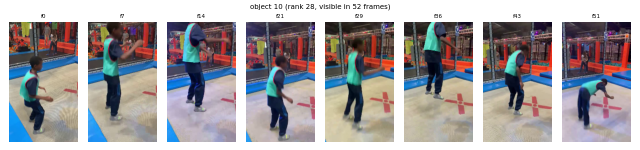

> A tall, vertical structure resembling a ladder or scaffolding stands prominently, characterized by its intricate lattice framework. The object appears to be constructed from a series of interconnected metal bars, forming a sturdy framework that suggests functionality and support. As the sequence progresses, the object maintains its upright position, with the vertical bars creating a sense of height and stability. The structure's surface reflects a subtle sheen, indicating a metallic material that catches light variably. Throughout the sequence, the object remains stationary, emphasizing its role as a fixed element within the environment. Its presence suggests a utilitarian purpose, possibly for climbing or support, and it interacts seamlessly with the surrounding space, maintaining its form and function without any noticeable change or movement.

### object 45 (rank 29, frames [0, 25, 41, 56, 72, 87, 103, 119])

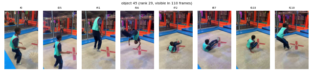

> A tall, slender object with a deep red hue, resembling a curtain, stands vertically. Its surface appears smooth and slightly reflective, catching subtle variations in light as it remains largely stationary. The object maintains a consistent upright position throughout the sequence, suggesting a sense of stability and weight. Its elongated form tapers slightly towards the top, giving it a sleek and elegant appearance. The object does not exhibit any movement or interaction with other elements, maintaining its poised and static presence throughout the sequence.

### object 25 (rank 30, frames [0, 15, 30, 57, 73, 88, 103, 119])

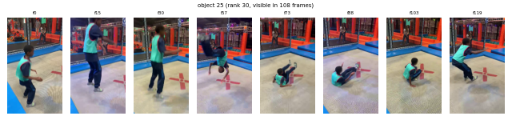

> A rectangular object, likely a padded mat, is prominently featured, displaying a smooth, green surface with subtle variations in shading that suggest a soft, cushioned texture. The object maintains a consistent shape throughout the sequence, with its edges appearing slightly rounded, indicating flexibility and resilience. As the sequence progresses, the mat exhibits a gentle, undulating motion, as if being lightly manipulated or adjusted. This movement suggests interaction, possibly being lifted or repositioned, which highlights its pliability and adaptability. The mat's surface catches light differently across its expanse, creating a dynamic play of shadows and highlights that enhance its three-dimensional appearance. Despite the changes in motion, the mat retains its integrity, showcasing its role as a stable and supportive object within the scene.

### object 35 (rank 31, frames [0, 17, 34, 51, 68, 85, 102, 119])


> A rectangular, dark blue object, likely a mat, is prominently featured, displaying a smooth and slightly reflective surface. It appears to be elongated and flat, with a consistent width throughout its length. The object maintains a steady position, suggesting it is either stationary or moving very subtly. Its surface is uninterrupted, indicating a solid structure, possibly designed for cushioning or support. The object does not interact with other elements, maintaining its solitary presence throughout the sequence. Its uniform color and texture remain constant, emphasizing its role as a stable and unchanging element within the scene.

### object 20 (rank 32, frames [0, 17, 34, 51, 68, 85, 102, 119])

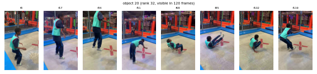

> A tall, slender object, likely a pole, stands upright with a deep, rich red hue that catches the light subtly, giving it a slightly glossy appearance. Its surface is smooth, with a consistent cylindrical shape that tapers slightly towards the top. As the sequence progresses, the pole remains stationary, maintaining its vertical orientation with a sense of stability and rigidity. The object does not exhibit any movement or interaction with other elements, emphasizing its role as a static, supportive structure. Its presence is marked by a quiet, unyielding strength, suggesting its function as a barrier or boundary within its environment.

### object 36 (rank 33, frames [0, 15, 44, 60, 74, 89, 104, 119])

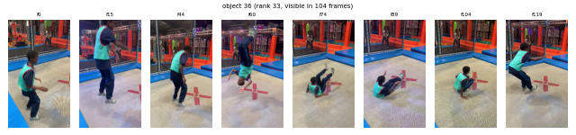

> A tall, slender object, likely a pole, stands upright with a smooth, dark surface that reflects subtle variations in light. Its elongated form is consistent throughout the sequence, maintaining a vertical orientation. The pole's surface appears to be metallic, with a slight sheen that catches the light, creating a gentle play of highlights and shadows. As the sequence progresses, the pole remains stationary, suggesting its role as a stable fixture. The lighting shifts subtly across its surface, indicating changes in the surrounding environment, possibly due to movement or changes in lighting conditions. Despite these changes, the pole's presence is unwavering, serving as a silent, steadfast element within the scene.

### object 14 (rank 34, frames [0, 8, 16, 27, 35, 43, 51, 60])

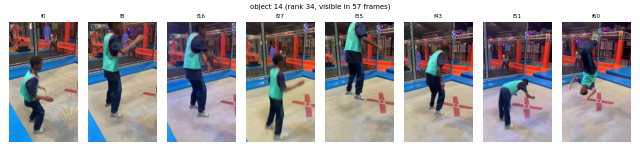

> A person wearing a light gray t-shirt and beige pants is captured in a sequence of fluid motion. Initially, they stand upright, with a relaxed posture, suggesting a casual stance. As the sequence progresses, the person begins to shift their weight, subtly turning their body to the side. Their arms, initially hanging naturally by their sides, start to move slightly, indicating a gentle turn. The movement is smooth and deliberate, as if they are preparing to engage in an activity or respond to an unseen stimulus. The person's head is slightly tilted, adding to the impression of attentiveness or focus. Throughout the sequence, the person maintains a steady pace, with their legs positioned to support a natural walking motion. The overall demeanor is calm and composed, reflecting a sense of ease and familiarity with their surroundings.

### object 34 (rank 35, frames [0, 22, 39, 55, 71, 87, 103, 119])

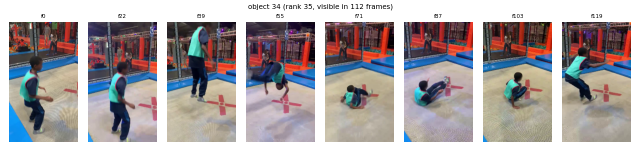

> A dark, elongated object, likely a mattress, is depicted with a smooth, slightly curved surface that suggests a soft, cushioned texture. It appears to be positioned horizontally, maintaining a consistent shape throughout the sequence. The object exhibits a subtle sheen, indicating a possibly synthetic or treated material that reflects light gently. As the sequence progresses, the mattress remains stationary, suggesting it is placed firmly on a surface, possibly a floor or a platform. Its edges are well-defined, and the overall form is sleek and streamlined, emphasizing its functional design. The mattress does not interact with other objects, maintaining its solitary presence in the sequence, which highlights its role as a stable and supportive structure.

### object 16 (rank 36, frames [0, 6, 13, 20, 27, 34, 41, 48])

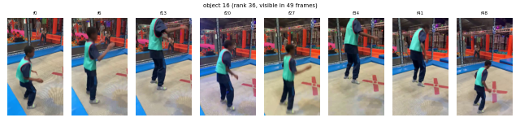

> A vibrant red platform, likely part of a playground structure, extends horizontally with a smooth, flat surface. Its elongated form is consistent throughout the sequence, maintaining a steady presence. The platform's edges are slightly rounded, suggesting a design meant for safety and comfort. As the sequence progresses, the platform remains stationary, indicating its role as a stable base or platform for activities. The consistent color and texture of the platform suggest it is made of a durable material, possibly rubber or a similar synthetic substance, designed to withstand frequent use. Its presence is unchanging, providing a sense of continuity and reliability within the scene.

### object 38 (rank 37, frames [0, 15, 31, 47, 71, 87, 103, 119])

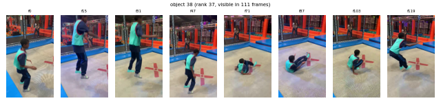

> A shoe, characterized by its smooth, rounded contours and a subtle sheen, appears to be in motion. The shoe's surface reflects light, suggesting a material that is both flexible and durable. As it moves, the shoe maintains a consistent shape, indicating a well-constructed design. The sole is slightly elevated, hinting at a cushioned interior for comfort. Throughout the sequence, the shoe exhibits a gentle, rhythmic motion, as if it is part of a dynamic activity. The shoe's movement is fluid, suggesting it is worn by someone in motion, possibly engaged in a sport or activity that requires agility and balance. The shoe's interaction with the ground is smooth, indicating a well-tuned mechanism that allows for seamless movement. Overall, the shoe's appearance and motion convey a sense of purpose and functionality, seamlessly integrating into the flow of activity.

### object 33 (rank 38, frames [0, 15, 33, 55, 71, 87, 103, 119])

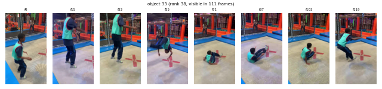

> A tall, cylindrical object with a smooth, deep red surface stands prominently, its form consistent and unchanging throughout the sequence. The object appears to be a punching bag, characterized by its sturdy, vertical structure and slightly rounded edges. As the sequence progresses, the object remains stationary, suggesting its role as a stable target for impact. Its surface reflects a subtle sheen, indicating a material that is likely designed to withstand repeated use. The object does not interact with other elements, maintaining its solitary presence, and its consistent appearance throughout the frames emphasizes its function as a reliable piece of gym equipment.

### object 27 (rank 39, frames [0, 18, 35, 51, 69, 85, 102, 119])

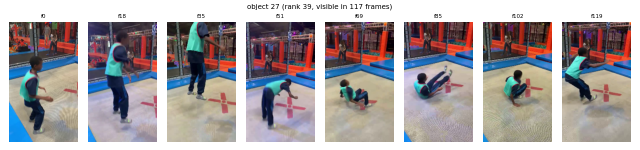

> An orange and green inflatable object, resembling a small, irregularly shaped cushion, appears to be part of a larger inflatable structure. It maintains a consistent, slightly curved form throughout the sequence, suggesting a flexible material typical of inflatable toys. The object exhibits a gentle, undulating motion, as if being lightly bounced or swayed, which enhances its playful and dynamic nature. Its vibrant colors, predominantly orange with hints of green, create a visually appealing contrast that draws attention. The object seems to be part of a larger inflatable setup, possibly used for recreational activities, as it moves in a way that suggests interaction with other similar elements. Its movement is smooth and continuous, indicating a well-inflated and stable structure, ideal for providing a soft landing or support.

### object 17 (rank 40, frames [0, 5, 11, 17, 22, 28, 34, 40])

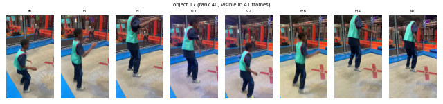

> A vibrant signboard, prominently featuring bold, stylized text, captures attention with its dynamic presence. The text is a striking combination of white and red, with the word "BATTLE" in white, standing out against a dark background, while the word "FIGHT!" is rendered in a vivid red, adding a sense of urgency and excitement. The signboard's surface is smooth and glossy, reflecting light subtly as it remains stationary. The letters are large and eye-catching, designed to be easily readable from a distance. Throughout the sequence, the signboard maintains its position, suggesting it is securely mounted, possibly on a wall or a similar structure. The consistent visibility of the text indicates its purpose as a focal point, likely intended to attract and guide attention in a bustling environment. The signboard's design and color scheme suggest it is part of a themed area, possibly a gaming or entertainment venue, where such vibrant and engaging visuals are common.

