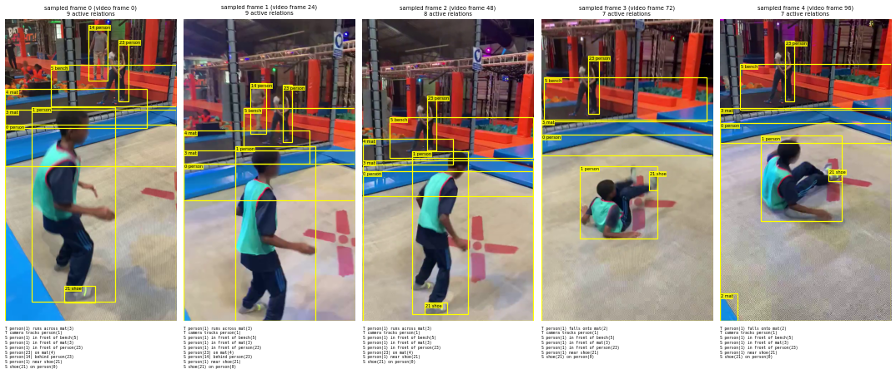

# Stages 5–6 on `sav_000001` (first 120 frames)

59 objects after stage 3; 40 DAM paragraphs; 120 frames (480x848, 24 fps)
Stage 5 with nvidia/nemotron-3.5-lightning-30b-a3b: 40 objects in 499 s (output format used: {'json_object', 'strict json_schema'})
Labels: {0: 'person', 1: 'person', 3: 'mat', 5: 'bench', 42: 'signboard', 4: 'mat', 24: 'mat', 49: 'truss', 7: 'pole', 6: 'trampoline spring', 12: 'rectangular object', 9: 'ladder', 61: 'mat', 59: 'rectangular object', 8: '', 62: 'ladder', 60: 'rectangular object', 18: 'pole', 13: 'rectangular panel', 2: 'mat', 19: 'padded panel', 41: 'pillar', 26: 'pole', 23: 'person', 21: 'shoe', 57: 'pipe', 15: 'mat', 10: 'ladder', 45: 'curtain', 25: 'mat', 35: 'mat', 20: 'pole', 36: 'pole', 14: 'person', 34: 'mattress', 16: 'platform', 38: 'shoe', 33: 'punching bag', 27: 'inflatable object', 17: 'signboard'}
Floor check: object 0 (the trampoline floor) was labelled 'person'
0 of 40 labels contain '(uncertain)': stage 6 will not see these objects
Stage 5 model comparison on 10 objects: same label 8/10, mean attribute overlap 39%
Stage 6 input: frames [0, 24, 48, 72, 96] → 10 items (image, text, image, text, …)
Stage 6 with moonshotai/kimi-k3: 3 temporal + 7 spatial relations in 38 s (formats: {'temporal': 'strict json_schema', 'spatial': 'strict json_schema'})
Stage 6 · moonshotai/kimi-k3: 10 relations, 0 fail the checks; temporal types {'motion': 1, 'functional': 1, 'attentional': 1}
Stage 6 · moonshotai/kimi-k3: relations that involve object 0 (the floor, labelled 'person'): [[21, 'on', 0, [[0, 4]]]]

## Stage 5 prompt (one object)

```
You are an information-extraction engine for visual scene understanding.

You are an expert in scene understanding. I will give you a short paragraph that describes a video clip.Your task is to extract structured information about a single object described in the paragraph.Please return a JSON with the following fields:

"object": The main object being described (e.g., "person", "dog", "car"). If the inference about the object is uncertain based on the description, add "(uncertain)" after the object name.

"attributes": A list of ONLY the visual/physical attributes that can be directly observed about the object itself. Include only:

Visual appearance: color, shape, size, texture, pattern, material appearance, style

Physical properties: state, transparency, reflectiveness, orientation, material

Design elements: stripes, dots, logos, decorative featuresDO NOT include: implied states, inferred conditions, functional descriptions, or anything that describes the object's interaction with its environment.

"relationships": A list of relationships between this object and other entities or the environment (e.g., "on top of table", "next to person", "inside container", "facing camera", "part of group").

"actions": A list of actions that the object is performing or movements it is making (e.g., "rotating", "moving", "falling", "bouncing", "sliding").

Important distinctions:

Attributes = What the object looks like (visual only). Please use ADJECTIVE form

Relationships = How the object relates to other things spatially, functionally, or contextually

Actions = What the object is doing or how it's moving

Now process the following description: """A young person, wearing a bright green vest with red trim and dark blue pants with light blue stripes, is captured in a dynamic sequence of movement. Initially, they are seen in a side profile, suggesting a moment of balance or preparation. As the sequence progresses, the individual shifts their weight, bending slightly forward, indicating a readiness to engage in an activity. Their arms are extended, possibly reaching out or preparing to interact with something in front of them. The person then transitions into a crouched position, with their legs bent and arms extended, suggesting a playful or athletic maneuver. This is followed by a moment where they are airborne, with their legs bent and arms reaching upwards, as if they are jumping or performing a flip. The sequence concludes with the individual landing back on their feet, maintaining a poised and energetic stance, ready for the next action. Throughout the sequence, the person's movements are fluid and expressive, conveying a sense of youthful exuberance and agility.""".
```

## Stage 6 input, frame 0 (text part)

```
{'frame id': 0, 'frame width': 480, 'frame height': 848, 'objects': [{'id': 0, 'label': 'person', 'bbox': [0, 295, 479, 847]}, {'id': 1, 'label': 'person', 'bbox': [74, 246, 308, 793]}, {'id': 3, 'label': 'mat', 'bbox': [0, 253, 479, 412]}, {'id': 5, 'label': 'bench', 'bbox': [127, 128, 479, 244]}, {'id': 42, 'label': 'signboard', 'bbox': [0, 0, 33, 17]}, {'id': 4, 'label': 'mat', 'bbox': [0, 196, 398, 305]}, {'id': 24, 'label': 'mat', 'bbox': [407, 246, 479, 294]}, {'id': 49, 'label': 'truss', 'bbox': [193, 0, 224, 9]}, {'id': 7, 'label': 'pole', 'bbox': [160, 0, 203, 245]}, {'id': 6, 'label': 'trampoline spring', 'bbox': [0, 231, 457, 339]}, {'id': 12, 'label': 'rectangular object', 'bbox': [387, 0, 430, 148]}, {'id': 9, 'label': 'ladder', 'bbox': [346, 0, 391, 144]}, {'id': 8, 'label': '', 'bbox': [259, 60, 335, 240]}, {'id': 18, 'label': 'pole', 'bbox': [452, 0, 479, 243]}, {'id': 13, 'label': 'rectangular panel', 'bbox': [142, 52, 212, 174]}, {'id': 2, 'label': 'mat', 'bbox': [0, 569, 166, 847]}, {'id': 19, 'label': 'padded panel', 'bbox': [206, 9, 251, 124]}, {'id': 41, 'label': 'pillar', 'bbox': [249, 0, 279, 37]}, {'id': 26, 'label': 'pole', 'bbox': [424, 0, 449, 108]}, {'id': 23, 'label': 'person', 'bbox': [318, 56, 345, 231]}, {'id': 21, 'label': 'shoe', 'bbox': [165, 749, 251, 795]}, {'id': 57, 'label': 'pipe', 'bbox': [448, 0, 461, 3]}, {'id': 15, 'label': 'mat', 'bbox': [0, 193, 278, 244]}, {'id': 10, 'label': 'ladder', 'bbox': [85, 0, 143, 111]}, {'id': 45, 'label': 'curtain', 'bbox': [196, 12, 209, 51]}, {'id': 25, 'label': 'mat', 'bbox': [296, 4, 335, 59]}, {'id': 35, 'label': 'mat', 'bbox': [417, 129, 479, 153]}, {'id': 20, 'label': 'pole', 'bbox': [440, 4, 472, 123]}, {'id': 36, 'label': 'pole', 'bbox': [278, 6, 296, 90]}, {'id': 14, 'label': 'person', 'bbox': [233, 14, 288, 171]}, {'id': 34, 'label': 'mattress', 'bbox': [212, 97, 246, 129]}, {'id': 16, 'label': 'platform', 'bbox': [0, 105, 144, 165]}, {'id': 38, 'label': 'shoe', 'bbox': [137, 683, 179, 708]}, {'id': 33, 'label': 'punching bag', 'bbox': [334, 9, 350, 92]}, {'id': 27, 'label': 'inflatable object', 'bbox': [132, 169, 250, 207]}, {'id': 17, 'label': 'signboard', 'bbox': [0, 13, 87, 65]}]}
```


